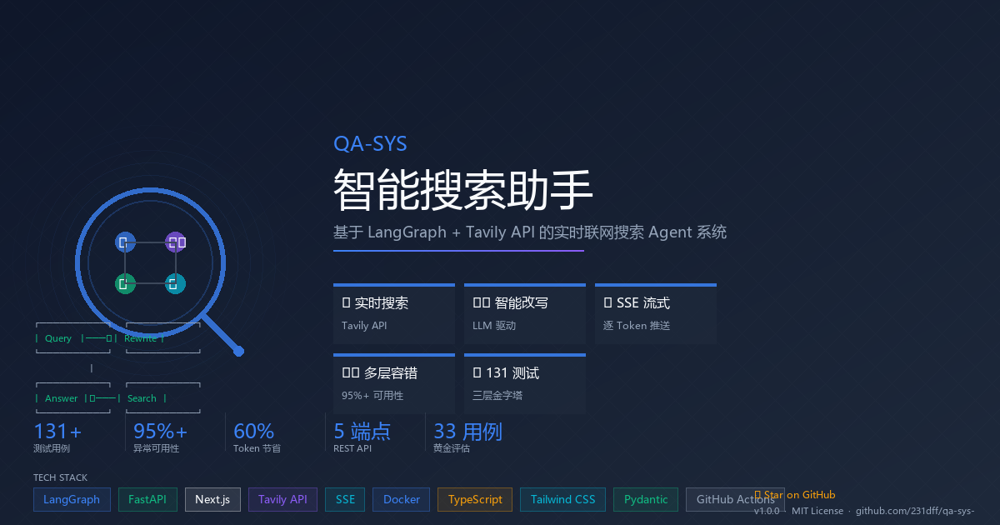

<p align="center">
  
</p>

<p align="center">
  <a href="https://github.com/231dff/qa-sys-"></a>
  <a href="LICENSE"></a>
  
  
  
  
  
</p>

<br>

# 🔍 智能搜索助手 — 实时联网搜索 Agent 系统

基于 **LangGraph** + **Tavily API** + **FastAPI** + **Next.js 16** + **Streamlit** 构建的实时联网搜索 Agent。

## ✨ 核心特性

- **实时搜索**: Tavily API 联网搜索，突破 LLM 知识时效限制
- **智能改写**: LLM 驱动的查询改写，将口语化提问转为精准搜索词
- **并行搜索**: 子查询并行搜索 + Tavily 原始分数过滤，省去冗余 LLM 打分调用
- **SSE 流式输出**: LLM 答案逐 Token 推送到前端，实时打字效果
- **多层容错**: 指数退避重试 + LLM 降级回答，异常期可用性 **95%+**
- **多轮对话**: 基于会话 ID 的上下文缓存，跨轮意图连贯
- **限流保护**: 搜索 API 配额管理与滑动窗口限流
- **连接池复用**: 全局共享 httpx 客户端，消除 TCP/TLS 握手开销
- **双前端**: Next.js 16 生产前端 + Streamlit 开发调试面板

## 🏗️ 架构

```
┌──────────────────┐     SSE Stream       ┌──────────────┐       HTTP         ┌────────────────┐
│ Next.js 16 前端   │ ◄─────────────────── │  FastAPI 后端  │ ──────────────────► │ LLM API (OpenAI │
│ (port 3001)       │   event: progress    │  (port 8000)   │   streaming POST   │  compatible)    │
│                   │   event: token       │               │                    │                │
│ React 19 + TS     │   event: sources     │  LangGraph     │ ──────────────────► │ Tavily Search   │
│ Tailwind CSS 4    │   event: done        │  Agent Pipeline│   Search API       │ API             │
│ App Router        │   event: error       │               │                    │                │
├──────────────────┤                       ├───────────────┤                    └────────────────┘
│ Streamlit 面板    │                       │ 全局 httpx     │
│ (port 8501)       │                       │ 连接池复用     │
│ 开发调试用         │                       │               │
└──────────────────┘                       └───────────────┘
```

### Agent 工作流

```
┌──────────────┐     ┌──────────┐     ┌──────────┐     ┌──────────┐
│  用户输入     │ ──→ │ 查询改写  │ ──→ │ 并行搜索  │ ──→ │ 答案生成  │
└──────────────┘     └──────────┘     └──────────┘     └──────────┘
                                           │                  │
                                     子查询并行            错误恢复
                                     跳过LLM打分           (降级回答)
```

## 📁 项目结构

```
qa/
├── agent/                          # Agent 核心模块
│   ├── __init__.py                 # 模块入口
│   ├── graph.py                    # LangGraph 状态图 (核心编排)
│   ├── models.py                   # Pydantic 数据模型 + AgentState TypedDict
│   └── streaming.py                # SSE 流式编排器
├── tools/                          # 工具注册中心
│   ├── __init__.py                 # 工具模块
│   └── registry.py                 # 4 个工具: 搜索/改写/打分/降级 + 组合流水线
├── memory/                         # 会话缓存
│   ├── __init__.py                 # 内存模块
│   └── session_store.py            # 会话缓存 (TTL 过期)
├── utils/                          # 工具函数
│   ├── __init__.py                 # 工具函数模块
│   ├── helpers.py                  # URL 去重, Token 计数, 限流, 裁剪
│   └── http_client.py              # 全局共享 HTTP 客户端 (连接池复用)
├── tests/                          # 测试 (131 条)
│   ├── __init__.py                 # 测试包
│   ├── test_core.py                # 单元测试 (去重/Token/限流/会话/模型)
│   ├── test_registry.py            # 工具注册中心测试 (搜索/改写/打分/降级/流水线)
│   ├── test_graph.py               # 状态图节点 + SearchAgent 类测试
│   ├── test_config.py              # 配置加载 + 单例测试
│   └── test_e2e.py                 # 端到端流水线 + 路由 + 会话测试
├── evals/                          # 行为评估
│   ├── __init__.py                 # 评估包
│   ├── golden_dataset.json         # 黄金行为数据集 (33 用例, 92 断言)
│   ├── evaluate.py                 # 自动化评估框架 (7 类别, HTML/JSON 报告)
│   ├── benchmark.py                # 延迟 & Token 基准测试 (对比优化前后)
│   ├── report.html                 # HTML 评估报告 (自动生成)
│   └── benchmark.html              # HTML 基准测试报告 (自动生成)
├── frontend/                       # Next.js 16 前端
│   ├── app/
│   │   ├── layout.tsx              # 根布局 (Geist 字体)
│   │   ├── page.tsx                # 应用入口页
│   │   ├── globals.css             # 全局样式 (Tailwind CSS 4)
│   │   └── api/chat/stream/
│   │       └── route.ts            # API 代理 (Next.js → FastAPI rewrite)
│   ├── src/
│   │   ├── components/
│   │   │   ├── ChatArea.tsx         # 聊天区域 (消息列表 + 输入框)
│   │   │   ├── ChatInput.tsx        # 消息输入框
│   │   │   ├── MessageBubble.tsx    # 消息气泡 (Markdown 渲染)
│   │   │   ├── Sidebar.tsx          # 侧边栏 (会话管理)
│   │   │   ├── SourcesPanel.tsx     # 来源面板
│   │   │   ├── MetaBar.tsx          # 元信息栏 (延迟/Token/置信度)
│   │   │   └── StreamingToken.tsx   # 流式 Token 动画
│   │   ├── hooks/
│   │   │   └── useSSE.ts            # SSE 流式连接 Hook
│   │   ├── lib/
│   │   │   ├── types.ts             # TypeScript 类型定义
│   │   │   └── api.ts               # API 调用封装
│   │   └── providers/
│   │       └── ChatProvider.tsx      # 聊天状态管理 (React Context)
│   ├── next.config.ts               # Next.js 配置 (rewrites 代理 + standalone 输出)
│   ├── package.json                 # 依赖: Next.js 16, React 19, Tailwind CSS 4
│   └── tsconfig.json                # TypeScript 配置
├── server.py                       # FastAPI 后端入口 (SSE + REST API + 生命周期管理)
├── app.py                           # Streamlit 开发调试面板
├── config.py                        # 全局配置 (pydantic-settings, 单例)
├── requirements.txt                 # Python 依赖
├── Dockerfile.backend               # 后端 Docker 镜像 (python:3.12-slim)
├── Dockerfile.frontend              # 前端 Docker 镜像 (多阶段 node:22-alpine)
├── docker-compose.yml               # 一键部署编排 (bridge 网络 + 健康检查)
├── .dockerignore                    # Docker 忽略规则
├── .env                             # 环境变量 (LLM_API_KEY, TAVILY_API_KEY 等, git-ignored)
├── fix-and-start.ps1                # Windows 一键修复 & 启动脚本
└── README.md
```

## 🚀 快速开始

### 方式一: Docker Compose (推荐)

确保已安装 [Docker Desktop](https://www.docker.com/products/docker-desktop/) 或 Docker Engine 20.10+。

```bash
# 1. 克隆项目后，先配置 API 密钥
# 编辑 .env，填入真实的 API Key
# LLM_API_KEY=sk-your-real-key
# TAVILY_API_KEY=tvly-your-real-key

# 2. 构建镜像并启动所有服务（首次需要几分钟构建）
docker compose up -d --build

# 3. 查看运行状态，确认两个服务都是 healthy
docker compose ps

# 4. 打开浏览器
# 前端界面: http://localhost:3001
# FastAPI 文档 (Swagger): http://localhost:8000/docs
# 健康检查: http://localhost:8000/api/health

# 5. 查看实时日志
docker compose logs -f backend    # 后端日志
docker compose logs -f frontend   # 前端日志

# 6. 停止服务
docker compose down
```

**Windows 用户**: 如果遇到 Docker Desktop gRPC 问题，可以直接运行一键脚本：

```powershell
.\fix-and-start.ps1
```

**关于 `docker compose up -d`**：
- `-d` 表示后台运行（daemon），不加 `-d` 可以在终端直接看到日志
- `--build` 表示每次启动前重新构建镜像，确保代码更新生效

**容器端口映射**：

| 服务 | 容器内端口 | 宿主机端口 | 说明 |
|------|-----------|-----------|------|
| `search-backend` | 8000 | 8000 | FastAPI + uvicorn，SSE 流式聊天 |
| `search-frontend` | 3000 | 3001 | Next.js 16 生产模式 (standalone) |

**常见问题排查**：

```bash
# 如果前端无法访问后端 API，检查后端是否启动
docker compose logs backend --tail 20

# 如果需要完全重建（清除缓存）
docker compose down
docker compose build --no-cache
docker compose up -d

# 如果 .env 修改后不生效
docker compose down && docker compose up -d --build
```

**镜像文件说明**：

| 文件 | 基础镜像 | 用途 |
|------|---------|------|
| `Dockerfile.backend` | `python:3.12-slim` | 安装 pip 依赖 → 启动 uvicorn |
| `Dockerfile.frontend` | 多阶段 `node:22-alpine` | `npm build` → 生产 runner 启动 `next start` |
| `docker-compose.yml` | — | 两服务编排 + 内部 bridge 网络 + 健康检查 |

### 方式二: 本地开发

#### 1. 安装 Python 依赖

```bash
pip install -r requirements.txt
```

#### 2. 配置 API 密钥

在 `.env` 文件中填入 API Key：

```bash
# LLM_API_KEY=sk-xxx
# TAVILY_API_KEY=tvly-xxx
# LLM_API_BASE=https://api.openai.com/v1   (可选，默认值)
# LLM_MODEL=gpt-4o-mini                      (可选)
```

#### 3. 启动后端

```bash
# FastAPI 开发服务器 (port 8000)
uvicorn server:app --reload --port 8000

# 或直接运行
python server.py
```

服务启动后可访问：
- API 文档 (Swagger): http://localhost:8000/docs
- 健康检查: http://localhost:8000/api/health

#### 4. 启动前端 (二选一)

**Next.js 生产前端**:

```bash
cd frontend
npm install
npm run dev
# → http://localhost:3000
```

**Streamlit 开发面板**:

```bash
streamlit run app.py
# → http://localhost:8501
```

#### 5. 运行测试

```bash
# 全部测试 (131 条)
pytest tests/ -v

# 按模块运行
pytest tests/test_core.py -v      # 单元测试 (33 条)
pytest tests/test_registry.py -v  # 工具注册中心 (31 条)
pytest tests/test_graph.py -v     # 状态图节点 (31 条)
pytest tests/test_config.py -v    # 配置加载 (18 条)
pytest tests/test_e2e.py -v       # 端到端 (18 条)

# 行为评估 (33 用例, 92 断言) + 基准测试
python -m evals.evaluate                     # 运行全部评估
python -m evals.evaluate -r html             # 生成 HTML 报告
python -m evals.evaluate -c happy_path       # 按类别运行
python -m evals.evaluate --case happy-001    # 单条用例
python -m evals.benchmark                    # 延迟 & Token 对比摘要
python -m evals.benchmark --html             # 生成 HTML 基准报告
python -m evals.benchmark --json             # 输出 JSON 格式
```

## 🧪 测试分层

项目采用**三层金字塔**测试策略，131 条测试 + 33 条评估用例（92 断言）全部 mock 外部 API，无需联网即可运行。

### 第一层: 单元测试 (`test_core.py` + `test_config.py`) — 51 条

| 测试类 | 覆盖内容 | 条数 |
|--------|----------|------|
| `TestURLDeduplicator` | URL 规范化、去重、滑动窗口、跟踪参数 | 7 |
| `TestTokenCounting` | 中英文 Token 计数 | 4 |
| `TestContentFingerprint` | SHA-256 内容指纹 | 4 |
| `TestRateLimiter` | 滑动窗口限流 | 3 |
| `TestContextTrimming` | Top-K + Token 裁剪 | 4 |
| `TestFormatSearchContext` | 搜索结果格式化 | 2 |
| `TestSessionStore` | 会话 TTL 存储 | 5 |
| `TestModels` | Pydantic 数据模型 (SearchResult/Answer/Query) | 3 |
| `TestAPIConfig` | 环境变量加载、SecretStr 安全、超限校验 | 7 |
| `TestAgentConfig` | 默认值、可变性、实例隔离 | 3 |
| `TestSingletonFunctions` | 单例缓存、类型区分 | 3 |
| `TestConfigCompleteness` | 字段完整性、非空校验 | 3 |
| `TestProjectRoot` | 根目录存在性 | 2 |

### 第二层: 集成测试 (`test_registry.py` + `test_graph.py`) — 62 条

| 测试类 | 覆盖内容 | 条数 |
|--------|----------|------|
| `TestTavilySearch` | 搜索成功/超时/异常/自定义参数/空结果/域名过滤 | 6 |
| `TestRewriteQuery` | 正常改写/历史上下文/LLM失败回退/JSON异常/默认值填充 | 6 |
| `TestScoreRelevance` | 打分成功/空输入/LLM失败回退/零分默认/内容截断 | 5 |
| `TestFallbackAnswer` | 降级回答/历史传递/自身失败/System Prompt/历史截断 | 5 |
| `TestSearchAndFilterPipeline` | 完整流水线/去重/API错误/空搜索/全重复/打分失败回退 | 6 |
| `TestToolRegistryMetadata` | 工具注册表完整性/类别匹配/唯一性 | 3 |
| `TestNodeRewriteQuery` | 状态更新/空查询/历史传递 | 3 |
| `TestNodeSearch` | 无查询/子查询拆分/状态键完整性 | 3 |
| `TestNodeGenerateAnswer` | 降级路径/片段生成/来源去重/历史上下文/二次降级 | 5 |
| `TestNodeErrorRecovery` | 标志设置/空消息/缺键默认 | 3 |
| `TestRoutingEdgeCases` | 缺键默认/空字符串/falsy值行为 | 5 |
| `TestSearchAgentClass` | 初始化/verbose/空历史/清除会话/去重器/latency | 6 |
| `TestAgentStateTypedDict` | 必需键完整/_fragments 私有键 | 2 |
| `TestAnswerSystemPrompt` | 非空/关键指令/足够长度 | 3 |

### 第三层: 端到端测试 (`test_e2e.py`) — 18 条

| 测试类 | 覆盖路径 | 条数 |
|--------|----------|------|
| `TestAgentPipelineE2E` | ①正常流程 ②搜索失败→降级 ③答案生成失败→二次降级 ④多轮对话 ⑤历史裁剪 ⑥改写失败→回退 | 6 |
| `TestRoutingLogic` | 搜索后路由 + 生成后路由 | 4 |
| `TestNodeBehaviors` | 错误恢复 + 空查询 + 降级生成 | 3 |
| `TestSessionManagement` | 自动 session + 清除会话 | 2 |
| `TestResultValidation` | 来源去重 + 延迟记录 + 流式输出 | 3 |

### 评估类别 (7 类, 33 用例, 92 断言)

| 类别 | 用例 | 覆盖场景 |
|------|------|----------|
| `happy_path` | 6 | 正常流水线 (事实查询/对比/指南/新闻/多语言) |
| `degradation` | 5 | 降级路径 (搜索失败/答案失败/改写失败/打分失败/超时) |
| `routing` | 5 | 路由逻辑 (搜索后/生成后/缺键边界) |
| `tool_behavior` | 6 | 工具行为 (搜索/SearchResponse/改写/打分/降级/流水线) |
| `multi_turn` | 4 | 多轮对话 (历史累积/上限裁剪/清除会话) |
| `state_integrity` | 2 | 状态完整性 (AgentState 键/GeneratedAnswer 字段) |
| `edge_case` | 5 | 边缘情况 (空查询/单字符/全角/超长/中文) |

## 🔧 工具注册

项目遵循**职责单一原则**注册 4 个工具：

| 工具 | 类别 | 职责 |
|------|------|------|
| `tavily_search` | 搜索 | Tavily API 实时联网搜索，使用 `get_http_client` 连接池复用 |
| `query_rewriter` | 改写 | LLM 口语化→精准查询词，支持子查询拆分 + 意图识别 |
| `relevance_scorer` | 打分 | LLM 0-1 相关性评分 (默认关闭，使用 Tavily 原始分数) |
| `fallback_answer` | 降级 | 搜索不可用时 LLM 知识回答，带 ⚠️ 标记 |

另有组合工具 `search_and_filter_pipeline()` 串联搜索→去重→(可选)打分→裁剪完整流水线。

## 📡 API 端点

| 端点 | 方法 | 描述 |
|------|------|------|
| `/api/chat/stream` | POST | SSE 流式聊天 (query, session_id, model, search_depth, top_k) |
| `/api/session/{id}` | GET | 获取会话历史 |
| `/api/session/{id}` | DELETE | 清除会话 |
| `/api/config/defaults` | GET | 获取默认配置 (model, search_depth, top_k, llm_api_base) |
| `/api/health` | GET | 健康检查 (status, active_sessions) |

### SSE 事件类型

```
event: progress  → {"node":"rewrite|search|generate|fallback|score","message":"..."}
event: token     → {"text":"逐token文本"}
event: sources   → {"sources":[{url,title,snippet}]}
event: done      → {confidence,latency_ms,tokens_used,is_fallback}
event: error     → {message,code}
```

## 🛡️ 容错机制

| 故障类型 | 恢复策略 |
|----------|----------|
| 搜索 API 超时 | 异步指数退避重试 3 次 → LLM 降级回答 |
| 查询改写失败 (JSON 解析/网络异常) | 回退到原始用户输入 |
| 相关性打分失败 | 使用 Tavily 原始分数 (已默认跳过 LLM 打分) |
| LLM API 故障 | 友好错误提示 + 二次降级 |
| 配额耗尽 | 滑动窗口限流，提前拦截 |

## 🐳 Docker 部署详解

### 前置要求

- [Docker Desktop](https://www.docker.com/products/docker-desktop/) (Windows/Mac) 或 Docker Engine 20.10+ (Linux)
- 确保 `docker compose` 命令可用：`docker compose version`

### 完整部署流程

```bash
# 1. 配置 API 密钥
# 编辑 .env 文件并填入真实的 API Key
# LLM_API_KEY=sk-your-real-key
# TAVILY_API_KEY=tvly-your-real-key

# 2. 构建并启动
docker compose up -d --build

# 3. 等待健康检查通过
docker compose ps
# 预期输出：两个服务 State 列都显示 Up (healthy)
```

### 常用操作

```bash
# 查看日志
docker compose logs -f backend          # 后端实时日志
docker compose logs -f frontend         # 前端实时日志
docker compose logs --tail=50 backend   # 后端最近 50 行

# 重启单个服务
docker compose restart backend
docker compose restart frontend

# 停止所有服务
docker compose down

# 完全重建（修改代码或 Dockerfile 后）
docker compose down
docker compose build --no-cache
docker compose up -d

# 进入容器调试
docker exec -it search-backend bash     # 后端的 bash
docker exec -it search-frontend sh      # 前端的 shell (alpine 无 bash)
```

### 健康检查验证

```bash
# 验证后端
curl http://localhost:8000/api/health
# → {"status":"ok","active_sessions":0}

# 验证前端
curl -I http://localhost:3001
# → HTTP/1.1 200 OK
```

## 📈 效果指标

- 正常期可用性: **≈100%**
- 异常期可用性: **95%+**
- LLM 调用减少: 5次 → 2次 (省 60%)
- Prompt Token 节省: **95.7%** (13,397 → 572 tokens/轮)
- 首 Token 延迟: 子查询并行 + 无打分等待，预计降低 **50%+**
- 连接池复用: 消除每次 HTTP 调用的 TCP/TLS 握手开销

## 📊 业务场景

- **实时新闻**: "今天有什么重大新闻？"
- **股价查询**: "苹果公司现在的股价是多少？"
- **热点事件**: "最近发生的 AI 领域大事件有哪些？"
- **对比分析**: "GPT-4 和 Claude 哪个更强？"
- **教程指南**: "最新的 Python 3.13 有哪些新特性？"

## 📄 License

MIT
